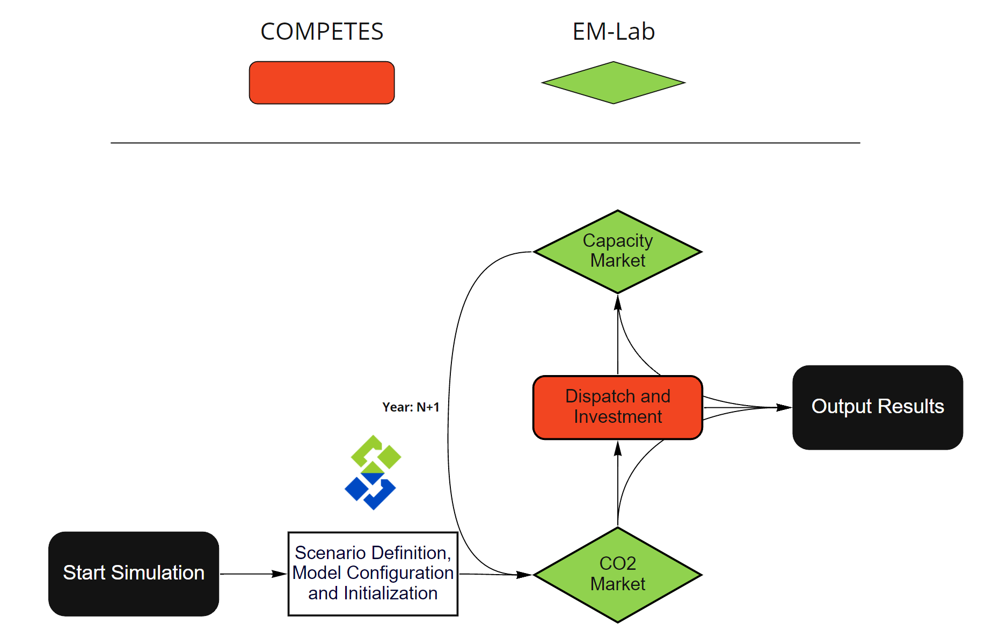

# Soft-linking of EM-Lab and COMPETES using SpineToolbox

EM-Lab is an agent based model focused on investigating the influence of interacting energy and climate policy on investments in the electricity sector. (http://emlab.tudelft.nl/) 
The model simulates power companies as agents that have an imperfect foresight. 
The investment decisions of the agents are based on expected power prices and the performance of different technologies. 
For this project, the CO2 module and the Capacity market module of EM-Lab were recreated in PYTHON to be able to soft-link them with Competes.  

COMPETES is an optimization model developed by TNO. It has a detailed dispatch and investment algorithm that can be run separately. It is programmed in AIMMS.

In this project, the EM-Lab modules and COMPETES were soft-linked using Spine Toolbox. 

This project was developed by Jim Hommes as part of his master thesis. 
### Exploring Soft-linking of Market Modules and an Optimization Model
http://resolver.tudelft.nl/uuid:63691862-9a26-4df3-b6dd-57bed6c9d8a5

